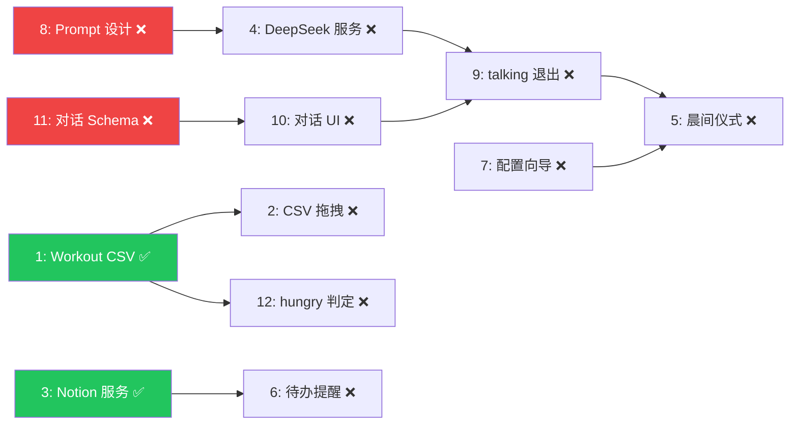

# 📋 项目进度 & 实施核查报告

> **审查日期**: 2026-04-24
> **审查范围**: [ichan_project_doc.md](file:///d:/ProjectCollection/personal_assistant_ichan/docs/ichan_project_doc.md) + [phaseb_execution_plan.md](file:///d:/ProjectCollection/personal_assistant_ichan/docs/phaseb_execution_plan.md) + 实际代码库交叉验证

---

## 1. 总体阶段判定

| 阶段 | 文档声明 | 代码验证 | 结论 |
|------|----------|----------|------|
| Phase A（播放器 + 状态机 + 动画） | ✅ 已完成 | ✅ [AnimationPlayer.ts](file:///d:/ProjectCollection/personal_assistant_ichan/src/components/Pet/AnimationPlayer.ts)、[StateMachine.ts](file:///d:/ProjectCollection/personal_assistant_ichan/StateMachine.ts)、[sequences.ts](file:///d:/ProjectCollection/personal_assistant_ichan/src/components/Pet/sequences.ts)、[PetCanvas.tsx](file:///d:/ProjectCollection/personal_assistant_ichan/src/components/Pet/PetCanvas.tsx) 等核心文件均存在且有实质代码 | **一致** |
| Phase A.5（参数冻结 / 体验冻结） | ✅ 已完成 | ✅ `petBehaviorConfig.ts`、DevPanel 组件、`phasea_5_optirepo.md` 均存在 | **一致** |
| Phase B（业务能力接入） | 🚧 进行中 | 🚧 仅 Batch 0 部分完成 | **一致** |

---

## 2. Phase B 任务逐项核查

### 2.1 Batch 0：契约与底座（任务 1, 3, 8, 11）

| 编号 | 任务 | 执行计划声明 | 代码实际情况 | 状态 |
|------|------|-------------|-------------|------|
| **1** | Workout CSV 解析 + SQLite 存储 | ✅ B0-1 已完成，5/5 测试通过 | ✅ [src/services/WorkoutService.ts](file:///d:/ProjectCollection/personal_assistant_ichan/src/services/WorkoutService.ts) (2.9KB) + [src-tauri/src/workout/mod.rs](file:///d:/ProjectCollection/personal_assistant_ichan/src-tauri/src/workout/mod.rs) (26.7KB) 存在且已注册到 [lib.rs](file:///d:/ProjectCollection/personal_assistant_ichan/src-tauri/src/lib.rs) | ✅ **已完成** |
| **3** | Notion Service 模块 | ✅ B0-3 已完成，tsc/cargo 检查通过 | ✅ [src/services/notion-service.ts](file:///d:/ProjectCollection/personal_assistant_ichan/src/services/notion-service.ts) (16KB) + [src/types/notion-types.ts](file:///d:/ProjectCollection/personal_assistant_ichan/src/types/notion-types.ts) (1.3KB) + [src-tauri/src/notion/mod.rs](file:///d:/ProjectCollection/personal_assistant_ichan/src-tauri/src/notion/mod.rs) (2.6KB) + [scripts/verify-notion.ts](file:///d:/ProjectCollection/personal_assistant_ichan/scripts/verify-notion.ts) 均存在 | ✅ **已完成** |
| **8** | 宠物人格 Prompt 设计 | 未有执行细则（5.x 节未覆盖） | ❌ 无对应文件，[deepseek/mod.rs](file:///d:/ProjectCollection/personal_assistant_ichan/src-tauri/src/deepseek/mod.rs) 为空文件 | ❌ **未开始** |
| **11** | 对话记录 SQLite schema | 未有执行细则（5.x 节未覆盖） | ❌ 无 `ChatHistoryStore` 实现、无相关 SQL schema | ❌ **未开始** |

> [!IMPORTANT]
> Batch 0 完成度为 **2/4**（50%）。任务 8 和 11 在执行计划中缺少 5.x 细则章节，尚未启动实施。

### 2.2 Batch 1：服务并行 + 交互壳（任务 2, 4, 7, 10, 12）

| 编号 | 任务 | 依赖满足 | 代码实际情况 | 状态 |
|------|------|---------|-------------|------|
| **2** | CSV 拖拽投喂交互 | ✅ 依赖任务1已完成 | ❌ 无拖拽交互相关实现 | ❌ **未开始** |
| **4** | DeepSeek Service 模块 | ⚠️ 依赖任务8（未完成） | ❌ 无 TS 服务文件；[deepseek/mod.rs](file:///d:/ProjectCollection/personal_assistant_ichan/src-tauri/src/deepseek/mod.rs) 为空 | ❌ **被阻塞** |
| **7** | 首次启动配置向导 | ✅ 无前置依赖 | ❌ 无向导组件 | ❌ **未开始** |
| **10** | 对话 UI 系统（interactive_box） | ⚠️ 依赖任务11（未完成） | ❌ [Dialog.tsx](file:///d:/ProjectCollection/personal_assistant_ichan/src/components/Dialog/Dialog.tsx) 存在但仅为占位 | ❌ **被阻塞** |
| **12** | hungry 自动判定逻辑 | ✅ 依赖任务1已完成 | ❌ 无自动判定逻辑代码 | ❌ **未开始** |

### 2.3 Batch 2：状态闭环（任务 6, 9）

| 编号 | 任务 | 依赖满足 | 代码实际情况 | 状态 |
|------|------|---------|-------------|------|
| **6** | 待办提醒功能 | ✅ 依赖任务3已完成 | ❌ [scheduler/mod.rs](file:///d:/ProjectCollection/personal_assistant_ichan/src-tauri/src/scheduler/mod.rs) 为空 | ❌ **未开始** |
| **9** | talking 正常退出机制闭合 | ❌ 依赖任务4, 10, 11 | ❌ 无实现 | ❌ **被阻塞** |

### 2.4 Batch 3：端到端集成（任务 5）

| 编号 | 任务 | 依赖满足 | 代码实际情况 | 状态 |
|------|------|---------|-------------|------|
| **5** | 晨间仪式完整流程 | ❌ 依赖 1,3,4,7,8,9,10,11 多项未完成 | ❌ 无实现 | ❌ **被阻塞** |

---

## 3. 进度总览

```
任务总数: 12
已完成:   2  (任务 1, 3)          ██░░░░░░░░  17%
未开始:   6  (任务 2, 7, 8, 11, 12, 6)
被阻塞:   4  (任务 4, 10, 9, 5)
```

### 关键路径分析



> [!WARNING]
> **当前最大阻塞点**是 Batch 0 中未完成的两项：**任务 8（Prompt 设计）**和**任务 11（对话 Schema）**。它们分别阻塞了 Batch 1 的任务 4 和任务 10，进而级联阻塞 Batch 2 的任务 9 和 Batch 3 的任务 5。

---

## 4. 文档一致性核查

### 4.1 [ichan_project_doc.md](file:///d:/ProjectCollection/personal_assistant_ichan/docs/ichan_project_doc.md) 任务看板 vs 实际进度

> [!CAUTION]
> [ichan_project_doc.md](file:///d:/ProjectCollection/personal_assistant_ichan/docs/ichan_project_doc.md) 第 9 节「当前任务看板」**未同步 Phase B 已完成项**。

| 看板条目 | 看板状态 | 实际状态 | **差异** |
|----------|----------|----------|----------|
| 实现 Workout CSV 解析 + SQLite 存储 | `[ ]` 待开始 | ✅ 已完成（B0-1） | ⚠️ 未更新 |
| 实现 Notion Service 模块 | `[ ]` 待开始 | ✅ 已完成（B0-3） | ⚠️ 未更新 |
| 其余 7 项 | `[ ]` 待开始 | ❌ 未开始 | 一致 |

**建议**: 将已完成的任务 1 和任务 3 从「待开始」移至「已完成」，并新增任务 10（对话 UI）、11（对话 Schema）、12（hungry 自动判定）到看板中（当前看板仅列 9 项，缺少 3 项）。

### 4.2 [phaseb_execution_plan.md](file:///d:/ProjectCollection/personal_assistant_ichan/docs/phaseb_execution_plan.md) 完整性

| 检查项 | 状态 | 说明 |
|--------|------|------|
| 第 5 章细则覆盖度 | ⚠️ 不完整 | 仅有 `5.1 B0-1` 和 `5.2 B0-3` 的执行细则；Batch 0 剩余任务 8、11 缺失细则 |
| B0-1 测试记录 | ✅ 完整 | 5/5 cargo test 通过 |
| B0-3 测试记录 | ⚠️ 部分 | 静态检查通过，真网联调未执行 |
| Batch 1-3 细则 | ❌ 缺失 | 无任何 Batch 1/2/3 的 5.x 执行细则 |

### 4.3 [lib.rs](file:///d:/ProjectCollection/personal_assistant_ichan/src-tauri/src/lib.rs) 注册状态 vs 文档声明

| 模块 | 文档声明 | [lib.rs](file:///d:/ProjectCollection/personal_assistant_ichan/src-tauri/src/lib.rs) 注册 | `mod` 声明 |
|------|----------|--------------|-----------|
| workout | B0-1 已完成 | ✅ 3 个命令已注册 | ✅ `mod workout` |
| notion/config | B0-3 已完成 | ✅ 2 个命令已注册 | ✅ `mod notion` |
| deepseek | 未实施 | ❌ 未注册 | ❌ 无 `mod deepseek` |
| scheduler | 未实施 | ❌ 未注册 | ❌ 无 `mod scheduler` |

> [!NOTE]
> `deepseek/` 和 `scheduler/` 目录虽存在，但 [mod.rs](file:///d:/ProjectCollection/personal_assistant_ichan/src-tauri/src/notion/mod.rs) 均为空文件（0 bytes），且未在 [lib.rs](file:///d:/ProjectCollection/personal_assistant_ichan/src-tauri/src/lib.rs) 中声明 `mod`。这些是预留的目录骨架，无实质代码。

---

## 5. 建议的下一步操作

### 5.1 立即行动（解除阻塞）

| 优先级 | 行动 | 说明 |
|--------|------|------|
| 🔴 P0 | 完成 **任务 8**（Prompt 设计） | 解除任务 4 (DeepSeek 服务) 阻塞 |
| 🔴 P0 | 完成 **任务 11**（对话 Schema） | 解除任务 10 (对话 UI) 阻塞 |
| 🟡 P1 | 并行启动 **任务 12**（hungry 判定）和 **任务 7**（配置向导） | 无前置依赖，可立即开工 |

### 5.2 文档同步

| 行动 | 责任方 |
|------|--------|
| 更新 [ichan_project_doc.md](file:///d:/ProjectCollection/personal_assistant_ichan/docs/ichan_project_doc.md) 第 9 节看板：任务 1、3 移至「已完成」 | 项目负责人 / Codex |
| 补齐看板缺失的 3 项任务（10, 11, 12） | 项目负责人 / Codex |
| 为 B0-8 和 B0-11 撰写第 5 章执行细则 | 对应 AI 负责人 |
| 安排 B0-3 的 Notion 真网联调（[verify-notion.ts](file:///d:/ProjectCollection/personal_assistant_ichan/scripts/verify-notion.ts)） | 项目负责人 |
